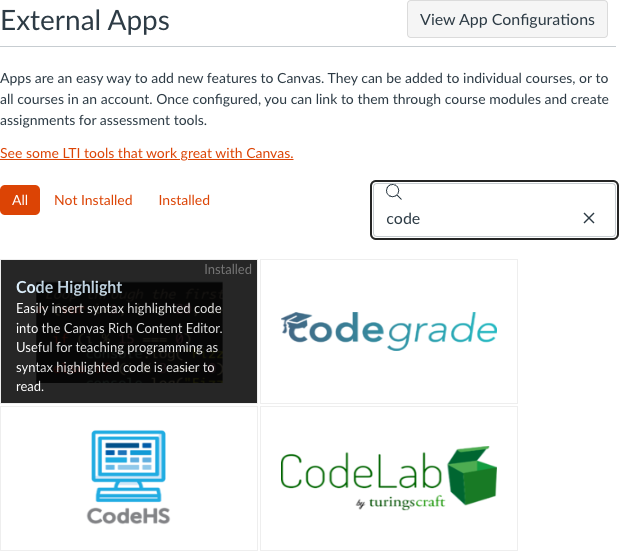
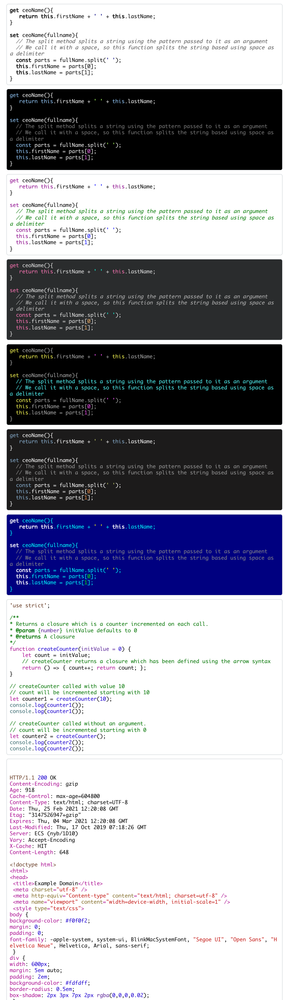
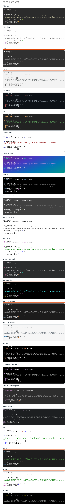
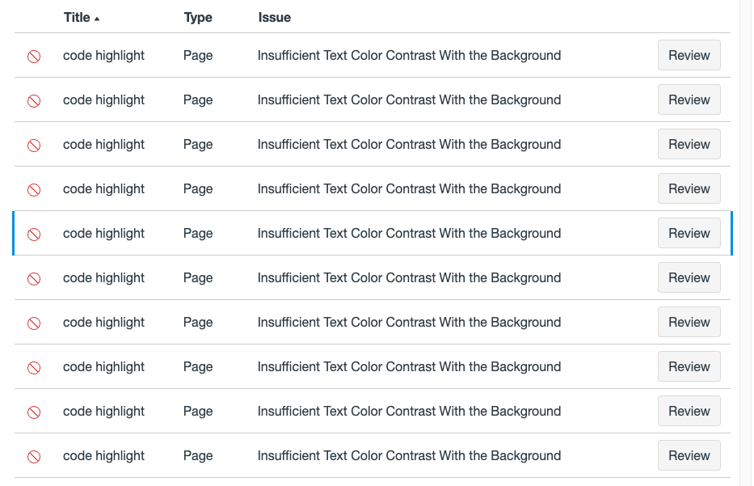
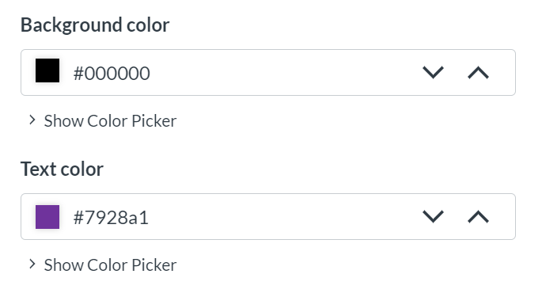

# Code Highlight Tool

## Overview

[Code Highlight](https://www.eduappcenter.com/apps/6199) is a Canvas app that provides syntax highlighting for code snippets used in Canvas. It works with various programming languages, including JavaScript, Python, Java, HTML/CSS, PHP, C/C++, and SQL. The tool allows users to customize the color scheme and formatting of code snippets to match their preferences. Code Highlight is integrated into the Rich Content Editor in Canvas.

Here are some examples of how the highlighting looks after using the LTI app on a selected code snippet:

## Instructions

- [Installation Instructions](https://www.wyelearning.com/support/code-highlight/#installation)
- [Demo on YouTube](https://youtu.be/cqFcjX3VN8U?si=KxLveauikkM3lvu4)

## Additional Resources

- [EduAppCenter: Syntax Highlighting Apps](https://www.eduappcenter.com/apps/6199)
- [Canvas LMS Accessibility Testing](https://osuecampus.slack.com/archives/C028KHFNFGV/p1712961114889129?thread_ts=1712956645.737099&cid=C028KHFNFGV)
- [UDOIT User Guide](https://osuecampus.slack.com/archives/C028KHFNFGV/p1712961362931619?thread_ts=1712956645.737099&cid=C028KHFNFGV)

## Accessibility

The following themes passed the [accessibility checker integrated into the Canvas Rich Content Editor](https://community.canvaslms.com/t5/Canvas-Basics-Guide/How-do-I-use-the-Accessibility-Checker-in-the-Rich-Content/ta-p/618238):

- A11y-dark
- A11y-light
- Dark
- Default
- Github-dark
- GML
- GoogleCode
- Gradient-dark
- Ir-black
- isbl-editor-dark
- isbl-editor-light
- nnfx-light
- panda-sytax-dark
- qtcreator-dark
- Stackoverflow-dark
- Stackoverflow-light
- Sunburst
- Tomorrow-night-bright
- tomorrow-nighteighties
- tomorrow-night
- VS
- VS2015
- Xcode
- XT256

UDOIT flags all the light ones, and here's why: for some reason, it thinks the background is black. It must have something to do with how the CSS is written that throws it off.

### Course Documentation

Here's what I have written in the Salesforce Course Record:

> The accessibility checker in Canvas is flagging code blocks for having insufficient text color contrast because it thinks the background is black. The tool we're using for syntax highlighting is adding styles that the accessibility checker doesn't interpret correctly.

## Related Ideas

- [Canvas](./Canvas.md)
- [Syntax Highlighting](Syntax%20Highlighting.md)
- [Accessibility](./Accessibility.md)
- [CSS](./CSS.md)
- [CS](CS.md)
- [UDOIT](UDOIT.md)
- [LTI](LTI.md)

